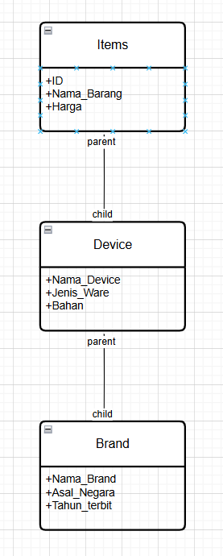

# Janji
Saya Nur Abdillah dengan NIM 2408515 mengerjakan Tugas Praktikum 1 dalam mata kuliah Desain Pemrograman Berorientasi Objek untuk keberkahan-Nya maka saya tidak akan melakukan kecurangan seperti yang telah di spesifikasikan

# Desain Program
Pemrograman terdiri dari 3 class yang memiliki inheritance satu sama lain dan setiap kelas terdiri dari 3 atribut :

Dan setiap kelas memiliki beberapa fungsi seperti berikut

1. Set dan Getter
2. Membalikkan ukuran text

# Penjelasan Program
Untuk pemrograman pada bahasa C++, Java dan Python memiliki function dan command yang sama yaitu sebagai berikut :

Menambahkan Data
Menampilkan Data
Mengedit Data
Menghapus Data
Mencari Data
Exit
Alur program dalam 3 bahasa ini, user akan diminta memasukkan angka untuk memilih program apa yg ingin dilakukan. Setelah itu setiap program akan menampilkan alur programnya sebagai berikut :

Menambahkan Data : User akan diminta memasukkan data berupa ID, Nama, Kategori, Brand dan Harga.
Menampilkan Data : Program akan menampilkan semua data yang ada di List tersebut.
Mengedit Data : User akan diminta memasukkan ID dari data yang ingin di-edit, setelah itu program akan mencari data tersebut dan setelah itu meminta input untuk perubahan pada data tersebut
Menghapus Data : User akan diminta memasukkan ID dan setelah itu program akan mencari ID data tersebut terus dihapus.
Mencari Data : User akan diminta memasukkan ID dan setelah itu program akan mencari ID data dan menampilkan isi dari data tersebut.
Sedangkan pemrograman di PHP Program akan menampilkan web simple, dan di program ini memiliki 6 atribut yaitu :

ID
Nama
Kategori
Brand
Harga
Foto
Selain itu juga PHP memiliki beberapa kolom untuk mengedit data, di kolom pertama untuk menambahkan data, terus di kolom kedua untuk mencari data dan di kolom terakhir menampilkan tabel yang di setiap row nya memiliki tombol update dan hapus.

# Dokumentasi Foto
1. C++

